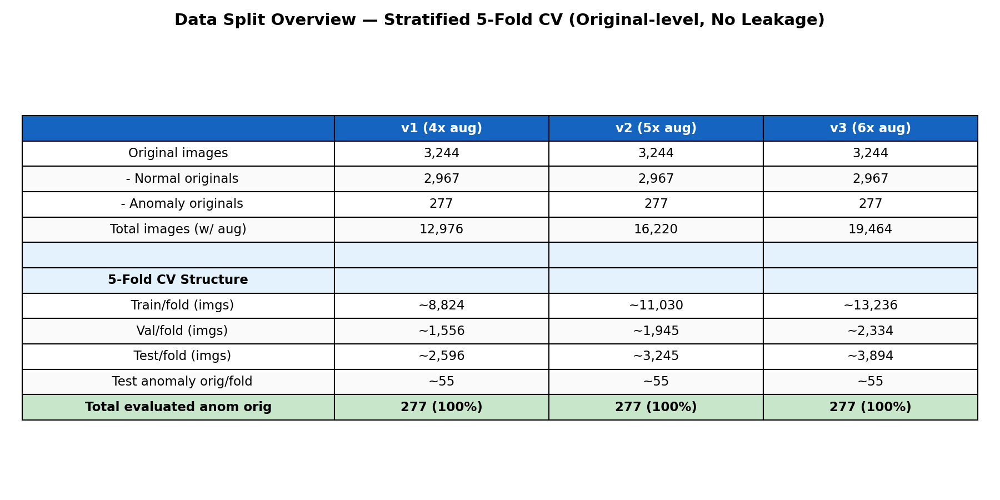
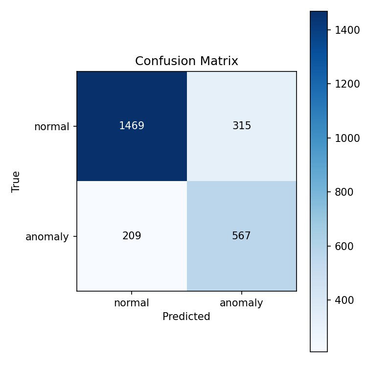
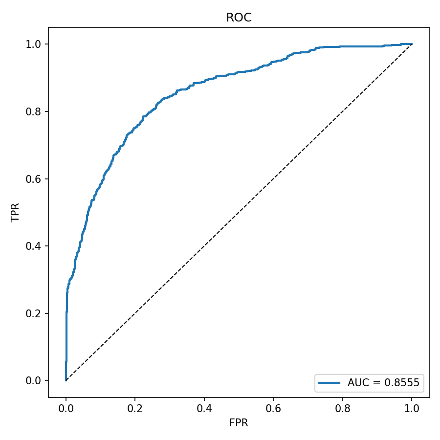
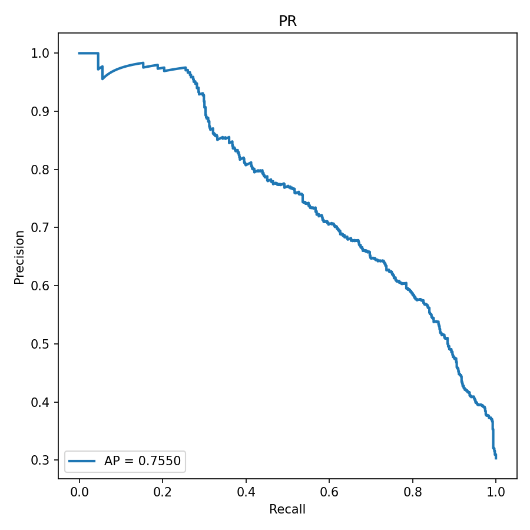
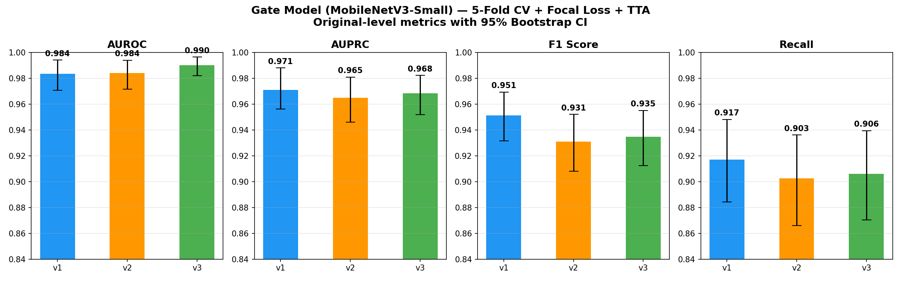
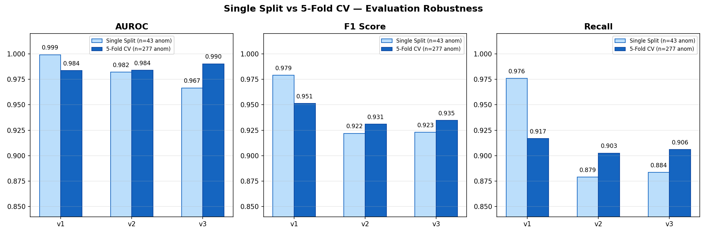

# 05/20 진행 내용 공유

이번 공유의 핵심은 데이터셋 자체 설명보다, **우리가 데이터를 어떻게 다시 분할해서 `v1 / v2 / v3` 3회전 실험 구조를 만들었는지**, 그리고 **그 구조로 다시 돌린 최종 cascade 결과가 무엇인지**입니다.

원래 증강 버전 `v1`, `v2`, `v3`는 이미 준비되어 있었고, 우리는 그 위에서 학습과 평가가 가능하도록 split 체계를 다시 정리했습니다.

---

## 1. 왜 split을 다시 만들었는지

기존 실험에서 가장 큰 문제는 **data leakage**였습니다.  
증강 이미지 단위로 train/val/test를 나누다 보니, 같은 원본 이미지의 다른 augmentation 버전이 train과 test에 동시에 들어가는 구조가 생겼습니다.

즉, 모델 입장에서는 완전히 처음 보는 테스트 이미지가 아니라, 사실상 비슷한 원본을 이미 train에서 본 상태가 되는 문제가 있었습니다.

그래서 이번에는 **원본 이미지 단위로 split을 다시 만드는 것**부터 시작했습니다.

---

## 2. 이번에 우리가 만든 split 구조

핵심은 아주 단순합니다.

1. 먼저 **원본 이미지 단위로** train / val / test를 나눔
2. 그 다음에 각 split 내부에서만 augmentation 이미지를 유지
3. 그래서 train-test, train-val, val-test 사이에 **같은 원본이 절대 겹치지 않게** 만듦

비율은 아래처럼 사용했습니다.

- train: 70%
- val: 15%
- test: 15%

그리고 이 split을 모델 역할에 맞게 두 갈래로 나눴습니다.

### Gate용 split

Gate는 normal / anomaly 이진 분류기라서 train, val, test에 두 클래스가 모두 들어갑니다.

- `v{N}_train_gate_mix.csv`
- `v{N}_val_gate.csv`
- `v{N}_test_gate.csv`

### PatchCore용 split

PatchCore는 normal-only 학습 구조라서 train에는 normal만 들어가고,  
평가용 val/test에는 normal과 anomaly가 같이 들어갑니다.

- `v{N}_train_normal.csv`
- `v{N}_val_mix.csv`
- `v{N}_test_mix.csv`

즉, 하나의 `vN` 버전에 대해

- Gate 학습/평가용 CSV 세트
- PatchCore 학습/평가용 CSV 세트

를 각각 따로 만든 구조입니다.

이렇게 해서 `v1`, `v2`, `v3`를 각각 하나의 실험 회차처럼 다룰 수 있게 만들었습니다.

정리하면:

- 1회전: `v1`
- 2회전: `v2`
- 3회전: `v3`

그리고 각 회전마다 같은 형식의 split, 같은 형식의 모델 산출물, 같은 형식의 평가 결과를 남기도록 맞췄습니다.  
MLOps 관점에서는 이 부분이 가장 중요합니다.

이미지:
- **출처:** noleak split 구조 설명
- `reports/assets/kfold_data_split_overview.png`

---

## 3. 이 구조로 어떤 실험을 다시 했는지

이번에는 크게 두 가지를 다시 했습니다.

### 1. PatchCore noleak 재학습

기존 cascade 결과는 Gate만 noleak이고 PatchCore는 예전 split 기준으로 남아 있어서 발표용으로 쓰기 애매했습니다.  
그래서 PatchCore를 `splits_noleak/` 기준으로 `v1`, `v2`, `v3` 모두 다시 학습했습니다.

공통 설정은 아래와 같습니다.

- Backbone: ResNet18
- Device: CPU
- Coreset ratio: 0.005
- k-NN: 9

### 2. 최종 cascade 재벤치마크

그 다음에 아래 조합으로 다시 측정했습니다.

`입력 이미지 -> MobileNetV3-Small gate -> 불확실하면 PatchCore -> 최종 판정`

즉, 이번 공유에서 말하는 최종 결과는

- `MobileNetV3-Small gate`
- `noleak 기준으로 다시 학습한 PatchCore`
- `splits_noleak` 기반 test split

을 조합해서 다시 벤치마크한 결과입니다.

---

## 4. PatchCore 단독 결과

PatchCore만 단독으로 보면 성능이 아주 강하다고 하긴 어렵습니다.  
하지만 여기서 중요한 건 standalone 점수보다, **2단계 보조 판정기로서 최종 cascade에 실제로 도움이 되는가**입니다.

| Version | AUROC | F1 | Recall | Precision |
|---|---:|---:|---:|---:|
| v1 | 0.8555 | 0.6840 | 0.7307 | 0.6429 |
| v2 | 0.7964 | 0.6220 | 0.7268 | 0.5436 |
| v3 | 0.7988 | 0.6222 | 0.7285 | 0.5429 |

아래 이미지는 **PatchCore 단독 결과**에서 나온 그림입니다.

이미지:
- **출처:** PatchCore noleak 재학습 결과
- `reports/assets/v1_patchcore_r18_test_mix_cm.png`
- `reports/assets/v1_patchcore_r18_test_mix_roc.png`
- `reports/assets/v1_patchcore_r18_test_mix_pr.png`

---

## 5. Gate 쪽은 어떤 상태였는지

Gate는 이번에 새로 고른 것이 아니라, 이미 `MobileNetV3-Small`로 방향을 잡고 있던 상태였습니다.  
즉 이번 작업의 포인트는 gate를 바꾸는 게 아니라, **그 gate 뒤에 붙는 PatchCore와 전체 cascade를 다시 정리하는 것**이었습니다.

Gate 쪽 비교 그림은 참고용으로 아래처럼 볼 수 있습니다.  
이 그림들은 **Gate 단독 결과**이며, final cascade 결과 그림은 아닙니다.

이미지:
- **출처:** Gate 성능 비교
- `reports/assets/kfold_v123_comparison.png`
- `reports/assets/kfold_vs_single_comparison.png`

---

## 6. 최종 Cascade 결과

여기부터가 가장 중요한 최종 결과입니다.  
최종 결과는 두 단계로 정리하는 게 정확합니다.

1. 먼저 `splits_noleak` 기준으로 cascade를 다시 벤치마크함
2. 그 다음 `val_gate`에서 버전별 threshold를 다시 탐색해서 `test_gate`에 고정 적용함

즉 아래 표는 **threshold 재조정까지 반영한 최종 성능표**입니다.

| Version | T_low | T_high | PatchCore threshold | Accuracy | Precision | Recall | F1 | Heatmap call rate | Latency / image |
|---|---:|---:|---:|---:|---:|---:|---:|---:|---:|
| v1 | 0.10 | 0.50 | 0.0000 | 0.9954 | 0.9503 | 1.0000 | 0.9745 | 0.05% | 52.61 ms |
| v2 | 0.20 | 0.65 | 3.2707 | 0.9861 | 0.9738 | 0.8651 | 0.9163 | 0.53% | 50.55 ms |
| v3 | 0.20 | 0.60 | 3.1818 | 0.9867 | 0.9582 | 0.8876 | 0.9215 | 0.27% | 50.23 ms |

threshold를 다시 잡기 전 초기 결과와 비교하면:

- v1: `0.9745 -> 0.9745` (변화 없음)
- v2: `0.8364 -> 0.9163` (개선)
- v3: `0.8423 -> 0.9215` (개선)

즉 `v1`은 원래 threshold가 이미 잘 맞아 있었고, `v2`, `v3`는 noleak 기준에서 threshold를 다시 맞추면서 성능이 꽤 회복됐습니다.

latency도 threshold 반영 상태로 다시 측정했습니다.

- v1: `52.61 ms` (`0.0526초/장`)
- v2: `50.55 ms` (`0.0506초/장`)
- v3: `50.23 ms` (`0.0502초/장`)

---

## 7. 지금 기준 해석

좋았던 점은 **v1 결과가 여전히 가장 설득력 있고**, `v2`, `v3`도 threshold 재조정 후에는 꽤 회복됐다는 점입니다.  
특히 `v2`, `v3`가 올라간 걸 보면, 이전 저하는 전부 구조 문제라기보다 noleak 기준 threshold 재설정이 반영되지 않았던 영향도 컸다고 볼 수 있습니다.

그래서 지금 기준으로 가장 안전한 메시지는 아래라고 생각합니다.

- leakage를 막기 위해 원본 단위 split을 다시 만들었다
- 그 구조 위에서 `v1 / v2 / v3` 3회전 실험을 다시 구성했다
- 각 회전마다 Gate용 split과 PatchCore용 split을 따로 만들어 동일한 형식으로 관리했다
- 그 결과 `MobileNetV3-Small gate + PatchCore` 조합은 `v1`에서 가장 강했고, `v2`, `v3`도 threshold 재조정 후 유의미하게 회복됐다

즉 발표 흐름은

`어떻게 데이터를 다시 나눠서 실험 구조를 만들었는지 -> 그 구조로 3회전 실험을 돌렸는지 -> 최종 cascade 결과가 어떻게 나왔는지`

이 순서로 가는 게 가장 자연스럽습니다.

---

## 8. 발표에서 이렇게 말하면 안전할 것 같음

- data leakage를 원본 이미지 단위 split으로 해결했다
- `v1 / v2 / v3`를 각각 하나의 실험 회차처럼 다시 구성했다
- Gate용 split과 PatchCore용 split을 분리해서 관리했다
- PatchCore를 noleak 기준으로 다시 학습한 뒤, 버전별 threshold까지 다시 맞춰 cascade를 재평가했다
- `MobileNetV3-Small gate + PatchCore` 조합은 v1에서 F1 `0.9745`, v2에서 `0.9163`, v3에서 `0.9215`를 기록했다
- latency는 threshold 반영 최종 기준으로 약 `0.05초/장` 수준이었다

반대로 지금은 보수적으로 가야 하는 표현은 아래입니다.

- 모든 버전에서 cascade가 매우 우수했다
- v2/v3까지 포함해 최종 구조가 완전히 검증됐다
- PatchCore 단독 성능도 충분히 강력하다

---

## 한 줄 요약

**이번 작업의 핵심은 데이터를 원본 단위로 다시 분할해서 `v1 / v2 / v3` 3회전 실험 구조를 만든 것이고, 그 구조 위에서 threshold까지 다시 맞춘 최종 cascade 결과에서는 v1이 가장 강했고 v2/v3도 유의미하게 회복됐다는 점입니다.**
